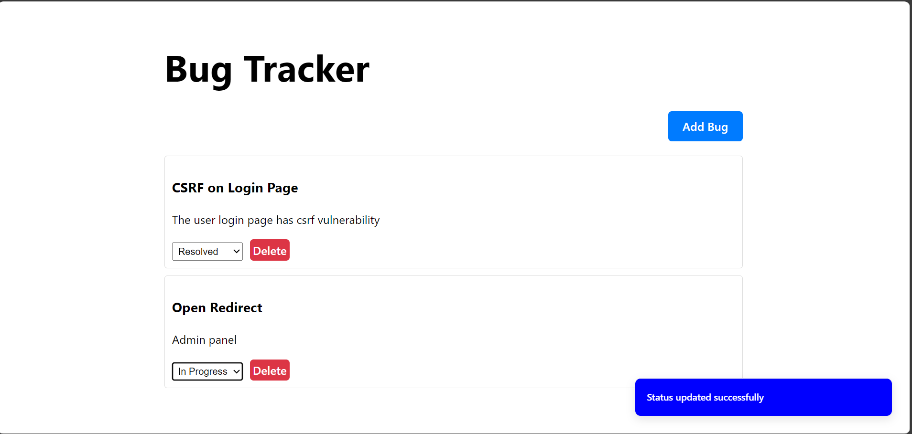
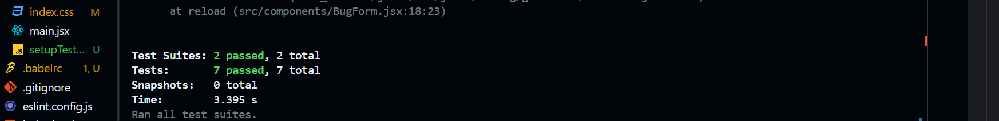
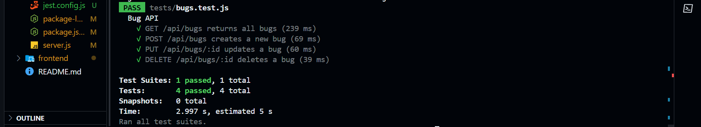

# MERN Bug Tracker

## Live Demo

[](https://bugtracker-bcni.onrender.com)

### [](https://bugtracker-bcni.onrender.com)

A full-stack bug tracking application built with MongoDB, Express.js, React, and Node.js (MERN stack). This project allows users to report, update, and delete bugs, with a backend API and a responsive frontend interface.

## Table of Contents

- [Features](#features)
- [Installation](#installation)
- [Running the Project](#running-the-project)
- [Running Tests](#running-tests)
- [Screenshots](#screenshots)

## Features

- **Backend**: RESTful API with CRUD operations for bugs (create, read, update, delete).
- **Frontend**: Modal-based bug reporting form, bug list with status updates, and delete functionality.
- **Notifications**: Toast notifications for status updates and deletions (using `sonner`).
- **Testing**: Unit and integration tests for both backend and frontend.

## Installation

### Prerequisites

- Node.js (v16 or higher)
- MongoDB (local or cloud instance, e.g., MongoDB Atlas)
- npm (comes with Node.js)

### Project Setup

1. Clone the repository

   ```bash
   git clone https://github.com/PLP-Full-Stack-Development-MERN/week-6-testing-and-debugging-SaddamTechie.git week6
   cd week6
   ```

2. Install dependencies:

   ```bash
      npm run build
   ```

3. Create a '.env' file in the 'week6' folder with the following:

   ```env
      PORT=5000
      MONGO_URI=<MONGO_URI>
   ```

   Replace MONGO_URI with your MongoDB connection string if using a cloud instance.

### Running the Project

```bash
   npm start
```

The server will run on http://localhost:5000.

Open your browser and go to http://localhost:5000

### Running Tests

**Backend tests:**

```bash
   npm test:backend
```

      This uses Jest with mongodb-memory-server for an in-memory database.
      Tests are located in backend/tests/bug.test.js.

**Frontend Tests**

```bash
   npm test:frontend
```

      This uses Jest with @testing-library/react for React component testing.
      Tests are located in src/**tests**/BugForm.test.js and src/**tests**/BugList.test.js.

### Screenshots

**Frontend Tests**


**Backend Tests**

